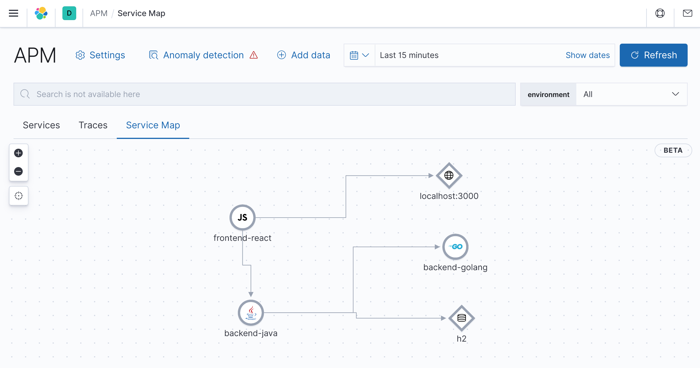

# From Zero to Hero with Observability

This project showcase [Elastic Observability](https://www.elastic.co/observability) by leveraging logs, metrics, and APM from three different microservices that build up a CRUD application. After starting the [Docker Compose](https://docs.docker.com/compose/) (note that it may take several minutes to complete) you can reach the application on [http://localhost:3000](http://localhost:3000) and the Elastic UI on [http://localhost:5601/app/observability](http://localhost:5601/app/observability).

# License

This project is licensed under the [Apache 2.0 License](./LICENSE).
